# RememberToBuy

A simple shopping cart app written in `C++`.

## Cloning

After cloning this repo, remember to initialize the submodules with:

```
git submodule init
git submodule update
```

## Compiling

A `Visual Studio 2017` solution file is located under `/src/RememberToBuy.sln`. Compiled binaries are copied to the directory `/dist/`.

## Screenshots

### Dashboard

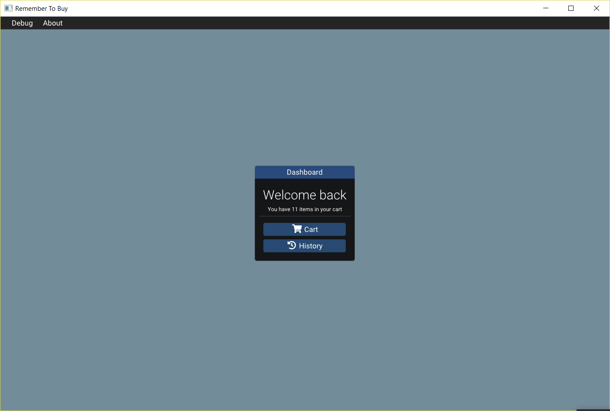

### Cart

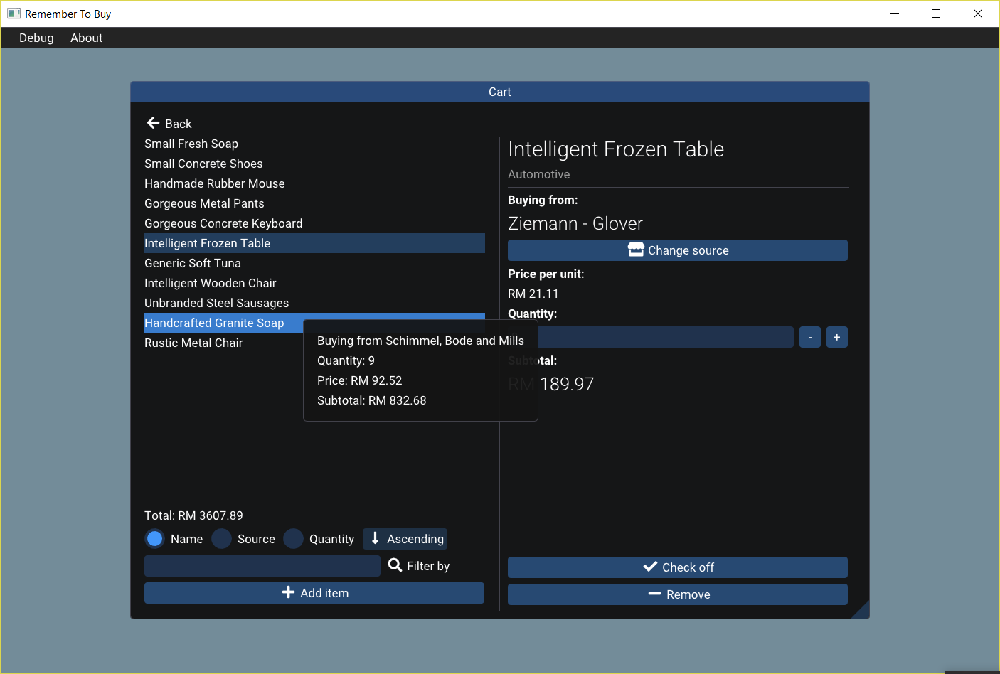

#### Check off an item

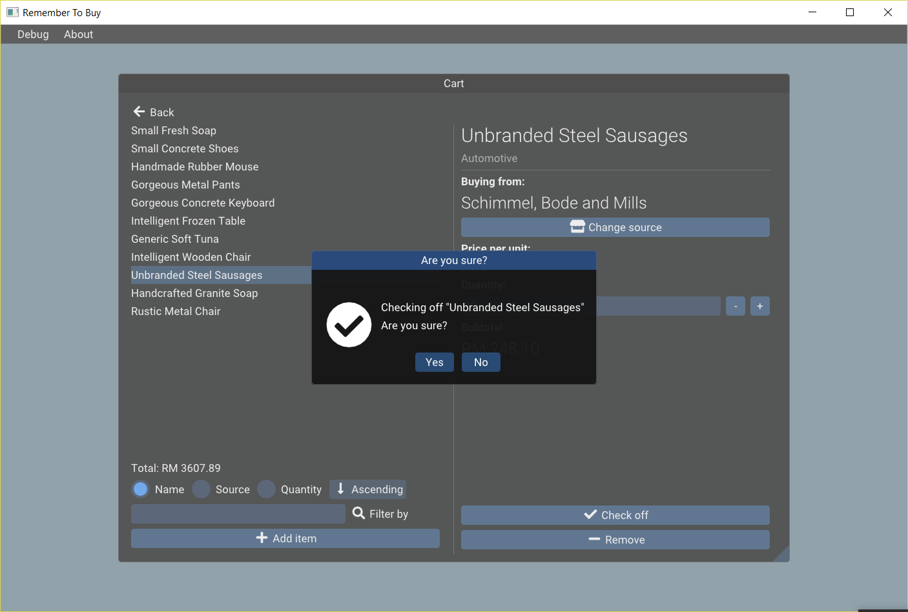

#### Searching cart items

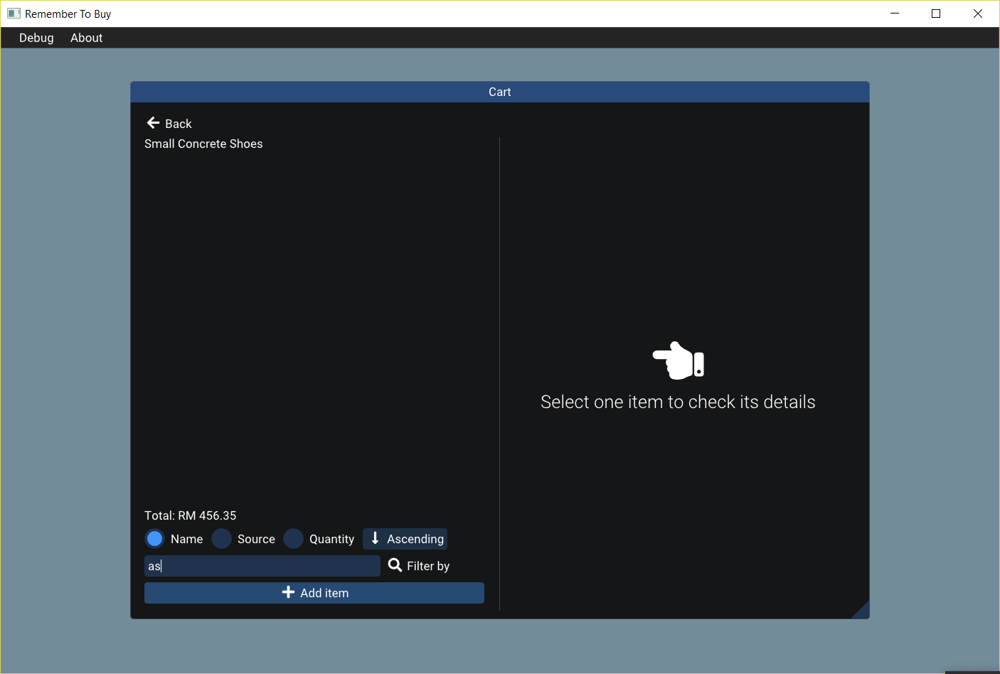

No results

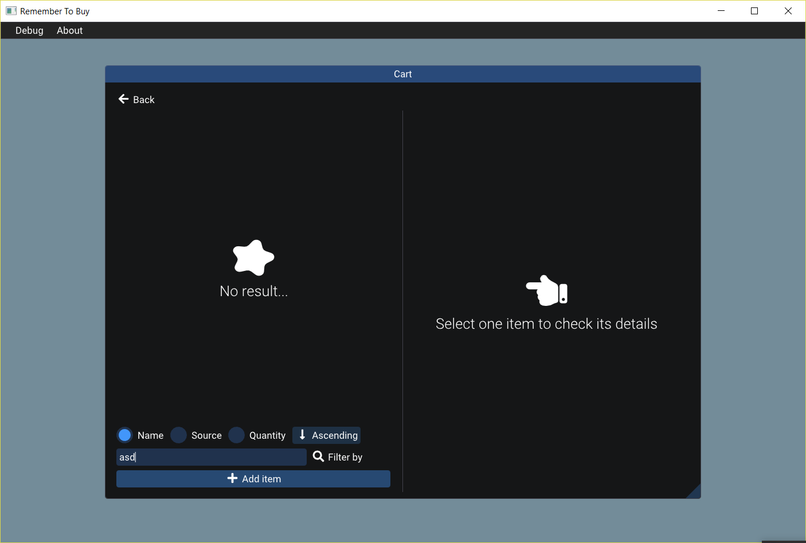

#### Changing source of an item

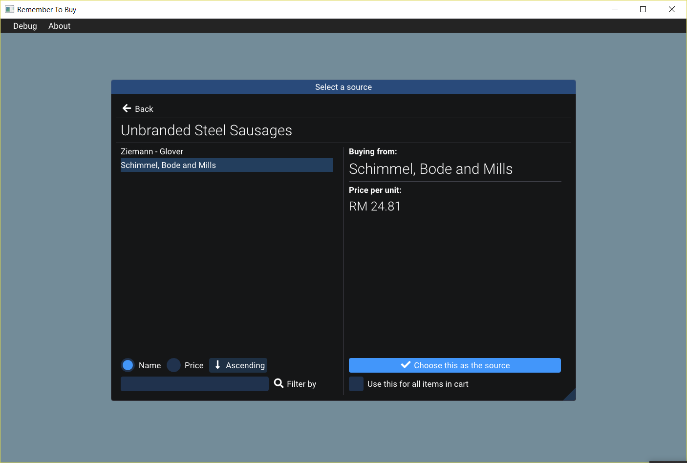


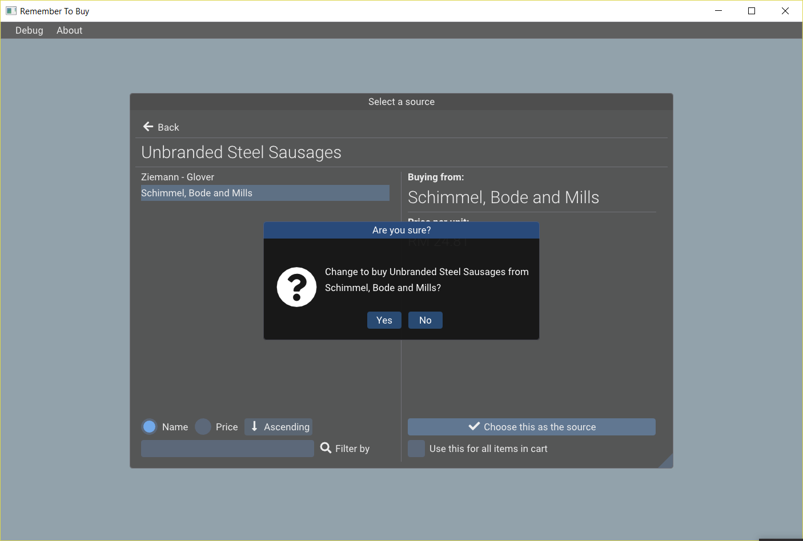

### Adding new item

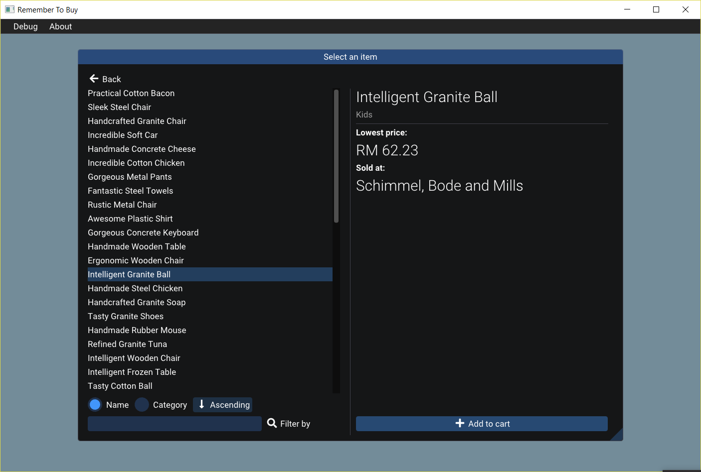

#### Confirm adding an item to cart

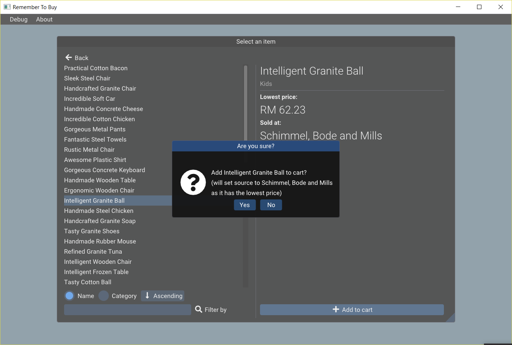

### History

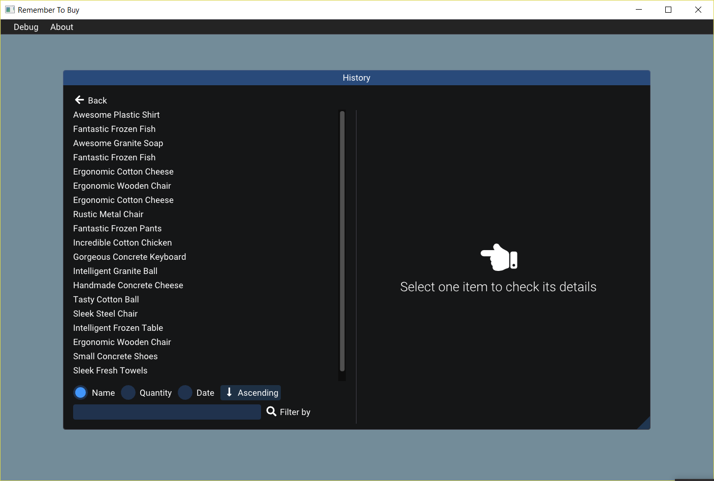

#### With item details

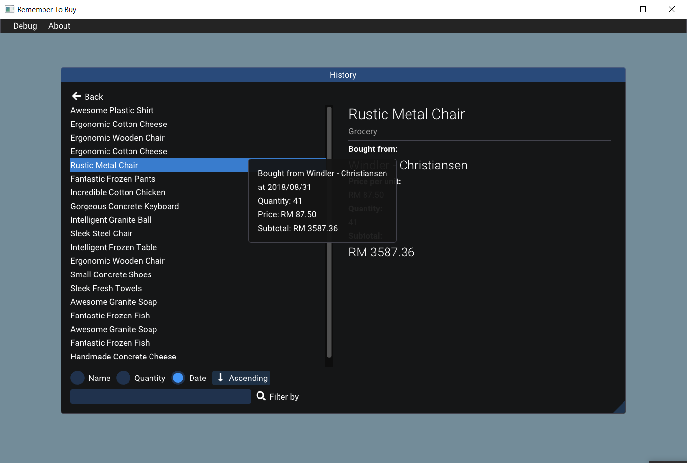

## Others

This project is made for my `TDS2111 - Data Structure and Algorithms` subject. The architectural design/libraries used is very similar to my previous project: @garyng/LabBookingSystem.